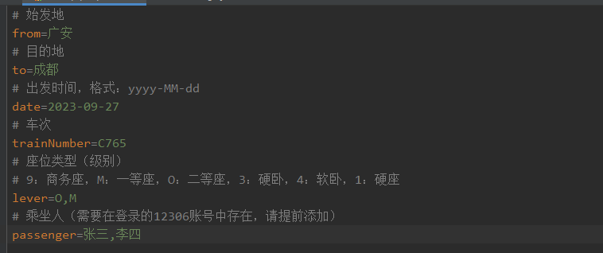
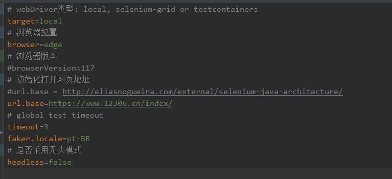

# 12306

	<strong>12306 抢票程序</strong>

    

> 10.1 国庆放假没抢到票，写了一个抢票脚本，人肉去抢实在抢不过啊。。。

## 快速开始

### 环境准备

* JDK 17
* Maven

> 项目自身引用 [WebDriverManager](https://github.com/bonigarcia/webdrivermanager) **自动下载管理 WebDriver**，无需本地维护。

### 代码执行

1. 拉取代码
2. 修改配置文件中对应的参数：
   [startup.properties](src%2Fmain%2Fresources%2Fdata%2F12306%2Fstartup.properties)
   
3. 执行测试用例
   [Ticket12306Test.java](src%2Ftest%2Fjava%2Fcom%2Fzach%2Ftest%2FTicket12306Test.java)

### 命令行执行

...

## 注意

**执行过程，需要在手机端打开 12306 软件进行扫码登录**

### 文件说明

1. [startup.properties](src%2Fmain%2Fresources%2Fdata%2F12306%2Fstartup.properties) **用于配置购票信息**
   
2. [general.properties](src%2Ftest%2Fresources%2Fgeneral.properties) 用于配置selenium driver
   
3. [12306.properties](src%2Fmain%2Fresources%2Fdata%2F12306%2F12306.properties) 12306基础配置信息
4. [selenium-grid.properties](src%2Ftest%2Fresources%2Fselenium-grid.properties) 用于配置远程selenium-grid
5. [suites](src%2Ftest%2Fresources%2Fsuites) 用于工程化自动化测试

### 最后
本项目只实现了一个简单的12306抢票，你也可以基于本项目完成更多自动化流程，例如：大麦网购票。<br：:;:::>
同时本项目完全可以作为**企业/团队内 UI 自动化项目**来使用，可扩展性（local, selenium-grid or testcontainers）、可维护性（内部包结构、模块、实体类定义）。
 最后，如果该项目帮你买到了车票，给你带来了帮助，或者让你你熟悉了 selenium 的常见用法，请给个**Star** ，谢谢。

