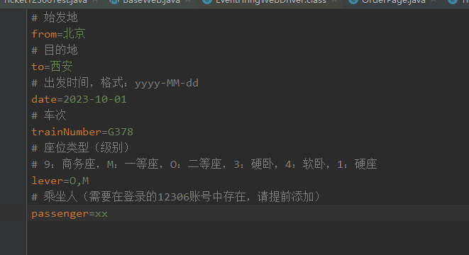

# 12306

	<strong>12306 抢票程序</strong>

    

> 10.1 国庆放假没抢到票，写了一个抢票脚本，人肉去抢实在抢不过啊。。。

## 快速开始

### 环境准备

* JDK 17

> 项目本身引用 [WebDriverManager](https://github.com/bonigarcia/webdrivermanager) **自动下载管理 WebDriver**。

### 代码执行
1. 修改配置文件中对应的参数：
[startup.properties](src%2Fmain%2Fresources%2Fdata%2F12306%2Fstartup.properties)

2. 执行测试用例
[Ticket12306Test.java](src%2Ftest%2Fjava%2Fcom%2Fzach%2Ftest%2FTicket12306Test.java)

### 命令行执行
...

## 注意
**执行过程，需要在手机端打开 12306 软件进行扫码登录**

